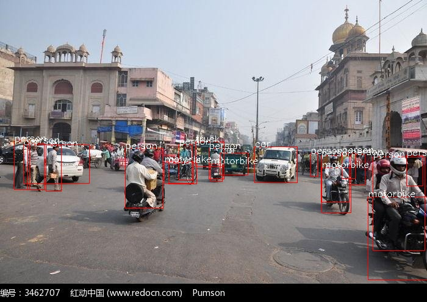

# pytorch 版 YOLO V3 

## 1070单张图片处理时间约为： 0.0425s

## 调用说明：为方便直接使用pytorch版本yolo v3进行封装 便于快速制作项目 免去读源码的时间
	main.py 程序主入口 可进行单张图片处理、单个视频处理、运行http服务接收图片输入
	utils/utils.py 封装处理各类数据的函数：
		draw_bbox_label:  往图像上画物体bbox以及标注其类别
		process_video:	处理单个视频
		process_img:  处理单张图片
		run_http:  启动http服务 （该服务主要给自己项目定制，晚些时间写出使用方法）
	utils/model.py	调用darknet.py加载yolo v3模型（带weights）
	utils/darknet.py  yolov3网络构造

## request:
    python3
    opencv-python
    pytorch
    numpy
    tornado

## install:
    git clone https://github.com/Rainweic/pytorch-yolov3.git
    mkdir pytorch-yolov3/yolo_v3_config
    cd pytorch-yolov3/yolo_v3_config
    wget https://pjreddie.com/media/files/yolov3.weights
    

## test:
    #Testing the Detection Effect of YOLO V3 With Single Picture
    python3 main.py --image test.jpg

  
  

    #Testing the Detection Effect of YOLO V3 With Video
    python3 main.py --image path_to_video

## python3 main.py -h:
    usage: main.py [-h] [--weight WEIGHT] [--coco_names COCO_NAMES]
               [--yolov3_cfg YOLOV3_CFG] [--confThreshold CONFTHRESHOLD]
               [--nmsThreshold NMSTHRESHOLD] [--inpWidth INPWIDTH]
               [--inpHeight INPHEIGHT] [--image IMAGE] [--video VIDEO]
               [--run_http RUN_HTTP] [--port PORT]

	optional arguments:
	  -h, --help            show this help message and exit
	  --weight WEIGHT       The path of yolov3.weights
	  --coco_names COCO_NAMES
		                The path of coco.names
	  --yolov3_cfg YOLOV3_CFG
		                The path of yolov3.cfg
	  --confThreshold CONFTHRESHOLD
		                Confidence threshold
	  --nmsThreshold NMSTHRESHOLD
		                Non-maximum suppression threshold
	  --inpWidth INPWIDTH   Width of network's input image
	  --inpHeight INPHEIGHT
		                Height of network's input image
	  --image IMAGE         path of image
	  --video VIDEO         path of video
	  --run_http RUN_HTTP   Open http server
	  --port PORT           http server's port

### 对github上高start的yolo v3版本进行便于使用的封装， 感谢
### 注释会进一步添加 
QQ： 861514706

		
